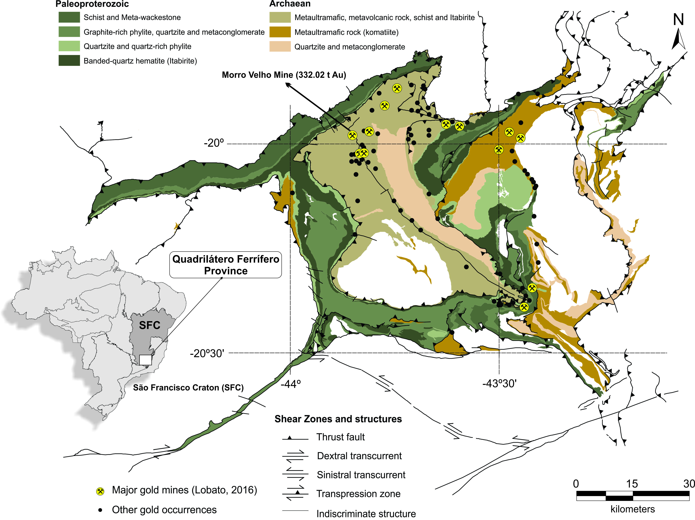
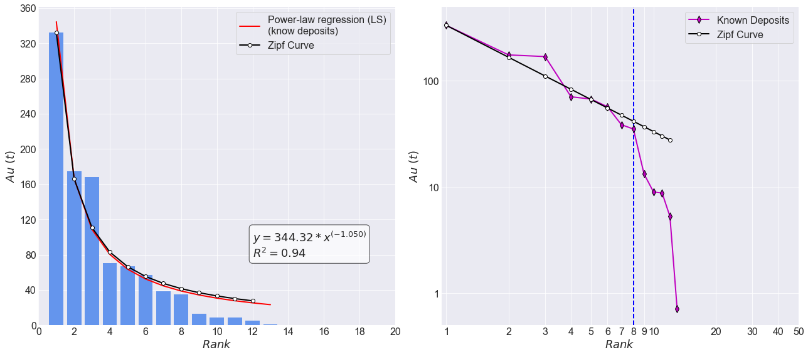
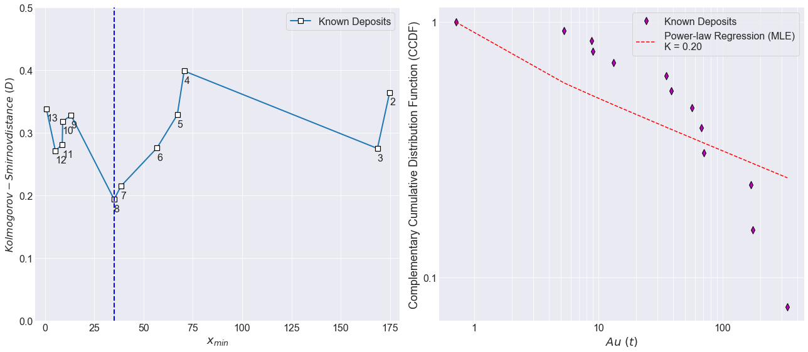
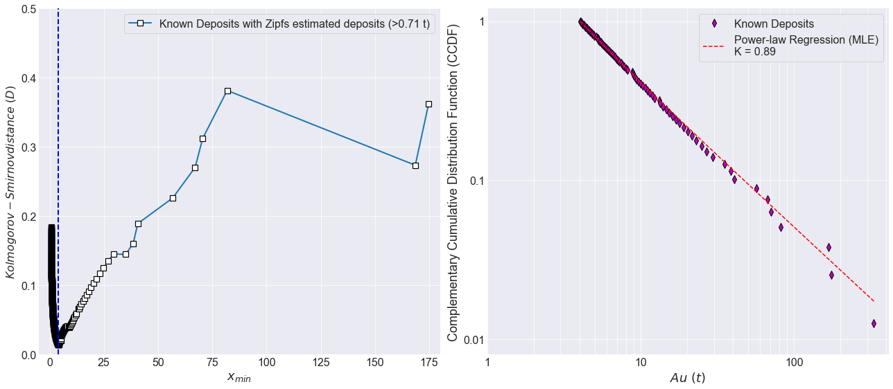
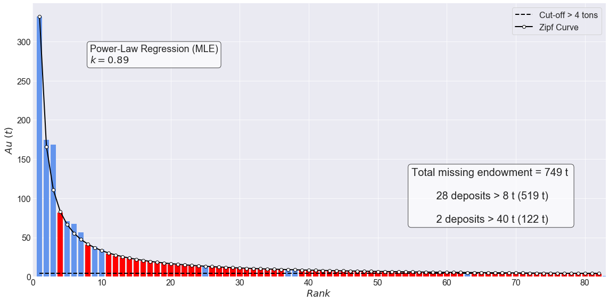

# Application of Zipf’s law for gold endowment assessment of Quadrilátero Ferrífero Province

Iago Costa*
CPRM - Geological Survey of Brazil
*iago.costa@cprm.gov.br

Guilherme Silva*
CPRM - Geological Survey of Brazil
*guilherme.ferreira@cprm.gov.br

Marcos Ferreira*
CPRM - Geological Survey of Brazil
*marcos.ferreira@cprm.gov.br

This is an executable version of a paper send to Journal of the Geological Survey of Brazil. This notebooks contains the code to generate the figures of the paper which was send to review.

When the paper is published it could be found [here](https://jgsb.cprm.gov.br/index.php/journal/index).

## Abstract

The ore-forming systems essentially act as self-organized critical systems. These systems exist in an unbalanced nature, where energy-release events can eventually occur in a scale-invariant power-law behavior when a threshold is exceeded. In ore-forming systems, the energy release from multiple transient pulses of overpressured fluid also appears to follow a power-law, since the distribution of mineral deposits in a province obey the Zipf's law. Zipf's law represents a statistical relationship between the size and rank of a discrete phenomenon. In this work, we present an application of Zipf's law to estimate the missing gold endowment of Quadrilátero Ferrífero Province. We also proposed the likelihood ratio test to confirm that deposits do not obey any distribution other than power-law, and the maximum likelihood estimator to calculate the power-law coefficient decay instead of least-squares regression. Furthermore, we argued about the limitation of the Zipf's law for small deposits and showed the Kolmogorov-Smirnov's minimum distance as an alternative to define the lower boundary of Zipf's law's domain rather than an economical filter. Our results estimated the Quadrilátero Ferrífero Province maturity in 65%, with potential for 749 t of gold, comprising 28 deposits large than 8 t (519 t), and 2 deposits large than 40 t (122 t).

## Set up


```python
# Libraries

import numpy as np
import matplotlib.pyplot as plt
import powerlaw
from sklearn.metrics import r2_score
from scipy.optimize import curve_fit
from matplotlib.ticker import MaxNLocator
from IPython.display import Latex
import warnings
warnings.filterwarnings("ignore", category=DeprecationWarning) 
warnings.filterwarnings("ignore", category=RuntimeWarning) 
plt.style.use('seaborn-darkgrid')

```


```python
# Functions 

def find_nearest(array, value):
    ''' find the nearest value in array '''
    array = np.asarray(array)
    idx = (np.abs(array - value)).argmin()
    return array[idx]


def test_distributions(value):
    ''' Compare the distribution between power law and other regressions '''

    results = powerlaw.Fit(value)
    
    R, p = results.distribution_compare('power_law', 'exponential')
    
    print('\nExponential (R) = %.2f  p = %.2f\n' % (R,p))
    
    R, p = results.distribution_compare('power_law', 'truncated_power_law')
    
    print('Truncated Power-Law (R) = %.2f  p = %.2f\n' % (R,p))
    
    R, p = results.distribution_compare('power_law', 'stretched_exponential')
    
    print('Stretched Exponential (R) = %.2f  p = %.2f\n' % (R,p))
    
    R, p = results.distribution_compare('power_law', 'lognormal_positive')
    
    print('Lognormal positive (R) = %.2f  p = %.2f\n' % (R,p))
    
    return results.power_law.xmin


def zipf_fill(value,cutoff):
    ''' Function to fill the data with zipf's values '''

    rank_new = []
    value_new = []
    
    max_rank = int(round((value[0]/cutoff)**(1/1.00)))
    x_zipf = np.arange(1., max_rank+1)
    C = value[0]
    y_zipf = C*x_zipf**(-1.00)
        
    for i in range(len(rank)):
        #x = rank[i]
        y = value[i]
             
        index = np.where(y_zipf==(find_nearest(y_zipf,y)))[0] + 1
        if not np.any(rank_new[:] == np.array([index])):
            rank_new.append(int(index))
        else:
            rank_new.append(int(index)+1)
        
        value_new.append(value[i])
        
    rank_reserves =  np.delete(np.arange(0,max_rank), rank_new)[1:]
    values_reserves = value[0]*rank_reserves**(-1.01)
    
    return np.sort(np.concatenate((values_reserves,value)))[::-1],rank_new,value_new

```

## Table 2


```python
####  Parameters

cutoff = 4   ## Quadrilatero Ferrífero - Cutoff estimated by Kolmogorov-Smirnov’s distance 
(see the paper for more details)

value = [8.78,70.58,168.62,174.80,8.97,13.26,0.71,38.53,5.28,332.02,35.08,67.11,56.80] 
# Values modified from Lobato et al., 2016)

#Lobato, L.M., da Costa, M.A., Hagemann, S.G., Martins, R., 2016. 
#       Ouro no Brasil: principais depósitos, produção e perspectivas. Recur. Minerais no Bras. 46.

print('Comparison between the power-law and alternative distributions for the gold '
'deposits of the Quadrilátero Ferrífero. ')
xmin = test_distributions(value)
#display(Latex('Minimum Value $(x_{min}) = %.2f $' % (find_nearest(value,xmin))))


```

    Comparison between the power-law and alternative distributions for the gold deposits of 
    the Quadrilátero Ferrífero. 
    
    Exponential (R) = 0.21  p = 0.90
    
    Truncated Power-Law (R) = -0.38  p = 0.38
    
    Stretched Exponential (R) = -0.27  p = 0.69
    
    Lognormal positive (R) = -0.20  p = 0.71
    
    
    

## Figure 1 


```python
from IPython.core.display import Image 
print('Figure 1 –  Simplified geological map of the Quadrilátero Ferrífero Province, with emphasis '
      'on the Rio das Velhas Supergroup (greenish tones) and the Minas Supergroup (brown tons). '
      ' Yellow filled circles represent the mines listed in this work. The black dots represent the '
      'other known occurrences and small mine sites (modified from Pinto and Silva, 2014). \n\n')

#Pinto C.P., Silva M.A. 2014. Mapa Geológico do Estado de Minas Gerais, Escala 1:1.000.000. Companhia 
#    de Desenvolvimento Econômico de Minas Gerais, CODEMIG e Serviço Geológico do Brasil, CPRM.
Image(filename='Figure_1.jpg')
```

    Figure 1 –  Simplified geological map of the Quadrilátero Ferrífero Province, with emphasis on the 
    Rio das Velhas Supergroup (greenish tones) and the Minas Supergroup (brown tons).  Yellow filled 
    circles represent the mines listed in this work. The black dots represent the other known occurrences 
    and small mine sites (modified from Pinto and Silva, 2014). 
    




## Figure 2


```python
print('Figure 2 - left) Descending order rank of known gold deposits of Quadrilátero Ferrífero\
 with the power-law regression curve (red line) and the Zipf’s curve (black line). right)\
    Log-log rank-size plot showing the known gold deposits, the power-law regression curve\
    (red), and the Zipf’s curve (black). The observed maximum rank is shown in a dashed\
    vertical blue line (rank 8).')

rank = np.arange(1,len(value)+1)
value = np.sort(value)[::-1]

max_rank = int(round((value[0]/cutoff)**(1/1.00)))


# Zipfs law
k = 1.00
x_zipf = np.arange(1., len(rank))
C = value[0]
y_zipf = C*x_zipf**(-k)

all_reserves,rank_new,value_new = zipf_fill(value,cutoff)
rank_reserves =  np.delete(np.arange(0,max_rank), rank_new)[1:]
values_reserves = value[0]*rank_reserves**(-1.01)

popt, pcov = curve_fit(lambda fx,a,b: a*fx**-b,  rank,  value)
power_y = popt[0]*rank**-popt[1]

######################################################### AXIS 1 ######################################
fig = plt.figure(figsize=(18,8))
props = dict(boxstyle='round', facecolor='white', alpha=0.7)

ax1 = fig.add_subplot(121)
ax1.bar(rank,value,color='cornflowerblue')
ax1.plot(rank, power_y, linewidth=2, color='r',label='Power-law regression (LS)\n(know deposits)')
ax1.plot(x_zipf, y_zipf, linewidth=2, color='k',marker='o',markerfacecolor='white',label='Zipf Curve')
ax1.legend(fontsize=16,frameon=True)
ax1.set_xlim(0,20)
ax1.set_xlabel(r'$Rank$',fontsize=18)
ax1.set_ylabel(r'$Au\ (t)$',fontsize=18)
textstr = '\n'.join((
        r'$y = %.2f*x^{(-%.3f)}$' % (popt[0],popt[1]),
        r'$R^2 = %.2f$' % r2_score(value, power_y)))

        
ax1.text(0.60, 0.3, textstr,transform=ax1.transAxes, fontsize=18, verticalalignment='top', bbox=props)
ax1.xaxis.set_tick_params(labelsize = 16)
ax1.yaxis.set_tick_params(labelsize = 16)
ax1.xaxis.set_major_locator(MaxNLocator(integer=True))
ax1.yaxis.set_major_locator(MaxNLocator(integer=True))


######################################################### AXIS 2 ######################################


ax2 = fig.add_subplot(122)
ax2.axvline(x=8,linewidth=2,color='blue',linestyle='dashed')
ax2.plot(rank, value, linewidth=2,color='m',marker='d',markersize=8,markeredgecolor='k',label='Known Deposits')
ax2.plot(x_zipf, y_zipf, linewidth=2, color='k',marker='o',markerfacecolor='white',label='Zipf Curve')
ax2.loglog()
ax2.set_xlim(0.95,50)
ax2.set_ylim(0.5,max(value)*1.5)
ax2.set_ylabel(r'$Au\ (t)$',fontsize=18)
ax2.set_xlabel(r'$Rank$',fontsize=18)
ax2.xaxis.set_tick_params(labelsize = 16)
ax2.yaxis.set_tick_params(labelsize = 16)
ax2.xaxis.set_ticks([1,2,3,4,5,6,7,8,9,10,20,30,40,50])
ax2.axes.set_xticklabels([1,2,3,4,5,6,7,8,9,10,20,30,40,50])

#### Equation with all ranks #######3#
#popt, pcov = curve_fit(lambda fx,a,b: a*fx**-b,  rank,  value)
#power_y = popt[0]*rank**-popt[1]


#ax2.text(rank[-1:]-11.8, power_y[-1:]+25, textstr, fontsize=18, verticalalignment='top', bbox=props)
#ax2.plot(rank, power_y, linewidth=2,color='red',label='Power-law regression (LS)\n(know deposits)')
ax2.legend(fontsize=16,frameon=True)
ax2.axes.set_yticklabels([0.001,0.1,1,10,100,1000])

plt.tight_layout()
```

    Figure 2 - left) Descending order rank of known gold deposits of Quadrilátero Ferrífero with the power-law 
    regression curve (red line) and the Zipf’s curve (black line). right)    Log-log rank-size plot showing the 
    known gold deposits, the power-law regression curve    (red), and the Zipf’s curve (black). The observed 
    maximum rank is shown in a dashed vertical blue line (rank 8).




## Figure 3


```python
print('Figure 3 - right) Kolmogorov-Smirnov’s distance for the known deposits of Quadrilátero Ferrífero. '
       'The minimum of the function (dashed vertical blue line) stands at rank 8 (or x_min=35.08). left) The '
       'log-log plot between the Complementary Cumulative Distribution Function (CCDF) and the gold deposits. '
       ' The dashed red line shows the power-law regression using the Maximum Likelihood Estimator (MLE) with'
       ' k=0.89.')

########################################### Axis one###############################
fig = plt.figure(figsize=(18,8))
props = dict(boxstyle='round', facecolor='white', alpha=0.7)

ax1 = fig.add_subplot(121)
results = powerlaw.Fit(value)
ax1.plot(results.xmins, results.Ds,marker='s',linewidth=2,markersize=8,markeredgecolor='k',
markerfacecolor='white',markeredgewidth=1.2,label='Known Deposits')
ax1.axvline(x=results.xmin,linewidth=2,color='blue',linestyle='dashed')
ax1.set_xlim(-5,180)
ax1.set_ylim(0,.5)
ax1.xaxis.set_tick_params(labelsize = 16)
ax1.yaxis.set_tick_params(labelsize = 16)
ax1.set_ylabel(r'$Kolmogorov-Smirnov distance\ (D)$',fontsize=16)
ax1.set_xlabel(r'$x_{min}$',fontsize=18)
ax1.legend(fontsize=16,frameon=True)

for i, txt in enumerate(np.sort(rank)[::-1][1:]+1):
    ax1.annotate(txt, (results.xmins[i]-0.020, results.Ds[i]-0.020),fontsize=16)

########################################### Axis two ###############################

ax2 = fig.add_subplot(122)

fit = powerlaw.Fit(value, discrete=True,xmin=min(value))

fit.plot_ccdf(color='m', linewidth=0,marker='d',markersize=8,markeredgecolor='k',
label='Known Deposits',ax=ax2)
fit.power_law.plot_ccdf(color='r', linestyle='--', ax=ax2,
label='Power-law Regression (MLE)\nK = %.2f' % (fit.alpha-1))

ax2.set_xlabel(r'$Au\ (t)$',fontsize=18)
ax2.set_ylabel('Complementary Cumulative Distribution Function (CCDF)',fontsize=18)
ax2.xaxis.set_tick_params(labelsize = 16)
ax2.yaxis.set_tick_params(labelsize = 16)
ax2.xaxis.set_ticks([1,2,3,4,5,6,7,8,9,10,20,30,40,50,60,70,80,90,100,200,300,400])
ax2.yaxis.set_ticks([0.1,1])
ax2.axes.set_xticklabels([1,'','','','','','','','',10,'','','','','','','','',100,'','',''])
ax2.axes.set_yticklabels([0.1,1])
ax2.legend(fontsize=16,frameon=True)
#print(fit.pdf()[1])

plt.tight_layout(w_pad=1.4)
```

    Figure 3 - right) Kolmogorov-Smirnov’s distance for the known deposits of Quadrilátero Ferrífero. The minimum
    of the function (dashed vertical blue line) stands at rank 8 (or x_min=35.08). left) The log-log plot between
    the Complementary Cumulative Distribution Function (CCDF) and the gold deposits.  The dashed red line shows 
    the power-law regression using the Maximum Likelihood Estimator (MLE) with k=0.89.
    
    




## Table 3


```python
new_reserves,rank_new,value_new = zipf_fill(value,cutoff=0.71)
print('Comparison between the power-law and alternative distributions for the gold '
'deposits of the Quadrilátero Ferrífero adjusted with Zipf’s law. ')
test_distributions(new_reserves)
```

    Comparison between the power-law and alternative distributions for the gold deposits of the 
    Quadrilátero Ferrífero adjusted with Zipf’s law. 
    
    Exponential (R) = 389.48  p = 0.00

    Truncated Power-Law (R) = -0.23  p = 0.49
    
    Stretched Exponential (R) = 2.33  p = 0.32
    
    Lognormal positive (R) = 47.63  p = 0.00
    


## Figure 4


```python
print('Figure 4 - right) Kolmogorov-Smirnov’s distance for the known deposits aggregated with Zipf’s '
      'estimated deposits. The minimum of the function (dashed vertical blue line) stands when x_min=4. left)  '
      'The log-log plot between the Complementary Cumulative Distribution Function (CCDF) and the filled '
      'deposits. The dashed red line shows the power-law regression using the Maximum Likelihood Estimator '
      ' (MLE) with k=0.89.')
########################################### Axis one###############################

#new_reserves,rank_new,value_new = zipf_fill(value,cutoff=0.71)

fig = plt.figure(figsize=(18,8))
ax1 = fig.add_subplot(121)

results = powerlaw.Fit(new_reserves,discrete=True)
ax1.plot(results.xmins, results.Ds,marker='s',linewidth=2,markersize=8,markeredgecolor='k',
markerfacecolor='white',markeredgewidth=1.2,
label='Known Deposits with Zipfs estimated deposits (>0.71 t)')
ax1.axvline(x=results.xmin,linewidth=2,color='blue',linestyle='dashed')
ax1.set_xlim(-5,180)
ax1.set_ylim(0,.5)
ax1.xaxis.set_tick_params(labelsize = 16)
ax1.yaxis.set_tick_params(labelsize = 16)
ax1.set_ylabel(r'$Kolmogorov-Smirnov distance\ (D)$',fontsize=16)
ax1.set_xlabel(r'$x_{min}$',fontsize=18)
ax1.legend(fontsize=16,frameon=True)

########################################### Axis two ###############################

ax2 = fig.add_subplot(122)

results.plot_ccdf(color='m', linewidth=0,marker='d',markersize=8,
markeredgecolor='k',label='Known Deposits',ax=ax2)
results.power_law.plot_ccdf(color='r', linestyle='--', ax=ax2,
label='Power-law Regression (MLE)\nK = %.2f' % (results.alpha-1))

ax2.set_xlabel(r'$Au\ (t)$',fontsize=18)
ax2.set_ylabel('Complementary Cumulative Distribution Function (CCDF)',fontsize=18)
ax2.xaxis.set_tick_params(labelsize = 16)
ax2.yaxis.set_tick_params(labelsize = 16)
#ax2.axvline(x=4,linewidth=2,color='blue',linestyle='dashed')
ax2.xaxis.set_ticks([1,2,3,4,5,6,7,8,9,10,20,30,40,50,60,70,80,90,100,200,300,400])
ax2.yaxis.set_ticks([0.01,0.1,1])
ax2.axes.set_xticklabels([1,'','','','','','','','',10,'','','','','','','','',100,'','',''])
ax2.axes.set_yticklabels([0.01,0.1,1])
ax2.legend(fontsize=16,frameon=True)
ax2.set_ylim(0.008,1.2)

plt.tight_layout()
```

    Figure 4 - right) Kolmogorov-Smirnov’s distance for the known deposits aggregated with Zipf’s estimated 
    deposits. The minimum of the function (dashed vertical blue line) stands when x_min=4. left)  The log-log
    plot between the Complementary Cumulative Distribution Function (CCDF) and the filled deposits. The dashed
    red line shows the power-law regression using the Maximum Likelihood Estimator  (MLE) with k=0.89.
    





## Figure 5


```python
print('Figure 5 - Known gold deposits (blue bars) fitted to the Zipf’s '
      'curve, and the rank gaps filled with undiscovered deposits (red bars) '
      'with endowment larger than 4 t.')

new_reserves,rank_new,value_new = zipf_fill(value,cutoff=cutoff)

x_zipf = np.arange(1., max(rank_new))
C = value[0]
y_zipf = C*x_zipf**(-k)

rank = np.concatenate((rank_new,rank_reserves))
value = np.concatenate((value_new,values_reserves))
rank.sort()
value[::-1].sort()

popt, pcov = curve_fit(lambda fx,a,b: a*fx**-b,  rank,  value)
power_y = popt[0]*rank**-popt[1]

#Plotting Figure

fig = plt.figure(figsize=(16,8))

ax1 = fig.add_subplot(111)
ax1.bar(rank_new,value_new,color='cornflowerblue')
ax1.plot(x_zipf, x_zipf*0+cutoff, linewidth=2,linestyle='dashed', color='k',label='Cut-off > %i tons' % cutoff)
#ax1.plot(rank, power_y, color='r',linewidth=2,linestyle='dashed',label='Power-law regression\n(know deposits)')
ax1.plot(x_zipf, y_zipf, linewidth=2, color='k',marker='o',markerfacecolor='white',label='Zipf Curve')
ax1.set_xlim(0,max_rank)
ax1.bar(rank_reserves,values_reserves,color='r') # New Discoverie
ax1.set_xlabel(r'$Rank$',fontsize=18)
ax1.set_ylabel(r'$Au\ (t)$',fontsize=18)
ax1.xaxis.set_tick_params(labelsize = 16)
ax1.yaxis.set_tick_params(labelsize = 16)

textstr_2 = 'Total missing endowment = %i t \n\n %i deposits > 8 t (%i t)\n\n %i deposits > 40 t (%i t)'
% (int(sum(values_reserves)),len(values_reserves[values_reserves > 8]),
int(sum(values_reserves[values_reserves > 8])),len(values_reserves[values_reserves > 40]),
int(sum(values_reserves[values_reserves > 40])))

ax1.text(0.80, 0.4, textstr_2, transform=ax1.transAxes, fontsize=20, verticalalignment='top', 
bbox=props,horizontalalignment='center')

textstr = '\n'.join((
        'Power-Law Regression (MLE)',
        r'$k = %.2f$' % (results.alpha-1)))
        
ax1.text(0.1, 0.85, textstr,transform=ax1.transAxes, fontsize=18, verticalalignment='top', bbox=props)
ax1.legend(fontsize=16,frameon=True)

plt.tight_layout()
```

    Figure 5 - Known gold deposits (blue bars) fitted to the Zipf’s curve, and the rank gaps filled with 
    undiscovered deposits (red bars) with endowment larger than 4 t.
    


